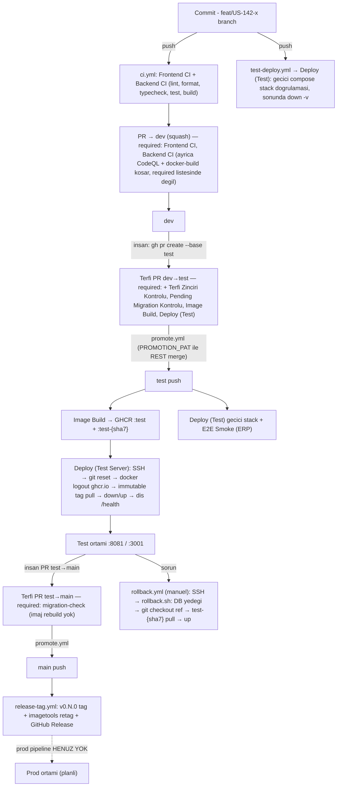

# DevOps Rehberi — Cargo Pilot Düzeninin Devri

## 1. Giriş

Bu rehber, Cargo Pilot projesinde (`cargo-pilot-prod`) kurulmuş ve yaklaşık bir yıl boyunca gerçek olaylarla olgunlaşmış DevOps düzeninin, **başka bir projeye kurulabilir** hâle getirilmiş dokümantasyonudur. Hedef okuyucu: psikoAL projesinde benzer bir düzen kuracak geliştirici.

Kaynaklar:

- `cargo-pilot-prod/.github/` altındaki 8 workflow + dependabot + PR şablonu + SECURITY.md (dosyalar doğrudan incelendi),
- `infra/` altındaki compose/docker/nginx/script düzeni,
- `docs/devops/` altındaki 8 operasyon dokümanı (deployment, server-access, secret-management, monitoring-setup, known-issues, iyileştirme analizi, backlog),
- test süreçleri (Vitest, Playwright, xUnit) ve `docs/conventions/` branch/commit sözleşmeleri,
- psikoAL'ın mevcut durumunun ayrı bir analizi (Bölüm 13).

Nasıl okunmalı:

- **Bölüm 2–11**: kaynak düzenin kendisi. Proje adları, IP ve domain gibi kaynağa özgü değerler `<YER_TUTUCU>` ile yazıldı; job adları, secret adları, komutlar ve action sürümleri ise bilinçli olarak **aynen** aktarıldı — bunlar düzenin çalışan parçalarıdır.
- **Bölüm 11**: yaşanmış olaylardan çıkan dersler. Rehberin en değerli kısmı; yeni kurulumda bu tuzaklara baştan önlem alın.
- **Bölüm 12**: sıfırdan kurulum checklist'i.
- **Bölüm 13**: psikoAL'a özel uyarlama — neyin taşınacağı, neyin taşınmayacağı ve çalışabilir YAML iskeletleri.
- Kaynak notlarında doğrulanamayan noktalar metin içinde açıkça **"kaynakta doğrulanmadı"** diye işaretlendi; rehberin sonunda toplu listesi var.

---

## 2. Genel Bakış

Düzenin özü: **üç dallı terfi modeli** (`feat/* → dev → test → main`) + **CI'da build edilip GHCR'a push edilen immutable imajlar** + **tek sunucuda port ofsetiyle yan yana test/prod ortamları** + **uygulamadan ayrı yaşayan monitoring stack'i**.



Temel ilkeler:

1. **Sunucu asla build etmez.** İmajlar CI'da build edilir, GHCR'a `:test` (mutable) + `:test-{sha7}` (immutable) çift tag'le push edilir; sunucu yalnızca pull eder.
2. **Deploy tetikleyicisi tektir**: sunucuya deploy yalnızca `test` dalına push ile olur. İş branch'i push'ları ve PR'lar sunucuya dokunmaz — runner içinde geçici stack kurulur, doğrulanır, silinir.
3. **Terfi disiplini insana değil CI'a emanettir**: `test`'e yalnızca `dev`'den, `main`'e yalnızca `test`/`hotfix/*`'ten PR açılabilir; CI job'u bunu zorlar.
4. **Monitoring uygulamadan bağımsızdır**: ayrı compose dosyası; deploy pipeline'ı monitoring'i deviremez.
5. **Rollback = git ref + o ref'in SHA'sından türetilen immutable imaj tag'i.** Git SHA ↔ imaj tag eşlemesi sözleşmenin kalbidir (ve Bölüm 11'de görüleceği gibi en kırılgan yeridir).

---

## 3. Branch ve Süreç Modeli

Kaynak: `docs/conventions/branching.md`, `docs/conventions/commits.md`, `.github/pull_request_template.md`.

### 3.1 Üç dallı terfi modeli

```
feat/US-142-x ──PR(squash)──► dev ──terfi PR(merge commit)──► test ──terfi PR(merge commit)──► main
```

| Dal | Rol | Deploy |
|---|---|---|
| `dev` | Günlük entegrasyon | Yok — yalnızca CI |
| `test` | QA / gösterim | Her merge'de test sunucusuna otomatik deploy |
| `main` | Prod'a hazır kod | Yalnızca sürüm etiketi (`v0.N.0`); prod pipeline'ı henüz yok |

Dört kritik kural:

1. Tüm iş branch'leri `dev`'den açılır.
2. `test`'e yalnızca `dev`'den PR (CI'daki `Terfi Zinciri Kontrolü` job'u zorlar).
3. `main`'e yalnızca `test` veya `hotfix/*`'ten PR.
4. `test`'e her merge otomatik deploy demektir — yarım iş `dev`'e bile merge edilmez; uzun riskli işler feature flag arkasına alınır.

Ek disiplin kuralları:

- **Test ortamında bulunan bug `test`'te düzeltilmez** — `dev`'den `fix/INC-xxx` açılır, dev'e merge edilir, yeniden terfi edilir. (Aksi hâlde dallar ayrışır; bkz. Bölüm 11.4.)
- **Hotfix sonrası geri-merge zorunlu**: `main → test`, `test → dev`. Atlanırsa bir sonraki terfi düzeltmeyi geri alır. Bu adım otomatikleştirilmedi — bilinen açık risk.
- İş branch'i ömrü ≤ 3 gün (`hotfix/*` saatler). Uzun yaşayan branch'ler geçmişte rebase edilemez hâle gelip silindi.
- Silinen branch'ler `archive/<ad>` tag'i olarak korunur.
- Ortam eşleme tablosu **tek dokümanda** yaşar (`docs/conventions/branching.md`); diğer dokümanlar tabloyu tekrarlamaz, delege eder — çift bakım önlenir.

### 3.2 Merge stratejisi — neden karışık?

| Yön | Yöntem | Neden |
|---|---|---|
| iş branch → `dev` | **squash** | Temiz geçmiş |
| `dev → test`, `test → main` | **merge commit** | Commit kimliği korunmalı; squash yeni commit üretir ve dallar **kalıcı** ayrışır |

GitHub ruleset'leri her dalda yalnızca doğru merge yöntemini açık bırakır (terfi dallarında squash kapalı). Terfi PR'ları `gh pr merge` ile DEĞİL `promote.yml` workflow'u ile merge edilir (nedenleri Bölüm 8.2'de — üç ayrı GitHub tuzağı var).

### 3.3 İsimlendirme ve commit sözleşmesi

- Branch: `<tür>/<İŞ-KODU>-<kebab-açıklama>` — tür küçük harf (`feat fix hotfix chore infra`), iş kodu BÜYÜK (`US-142`, `INC-002`); Türkçe karakter/boşluk yasak. `chore/` ve `infra/`'da iş kodu opsiyonel.
- Commit: sade, açıklayıcı, mümkünse Türkçe cümle ("docker compose local ortam için eklendi"); yasaklılar: "son", "fix", "update", "asdf". Conventional-commits **zorunlu değil**. Atomic commit ilkesi: 1 anlamlı değişiklik = 1 commit.

### 3.4 PR şablonu ve zorunlu kontroller

PR şablonu bölümleri (`.github/pull_request_template.md`): Özet · İlgili User Story/Issue · Değişiklik Tipi · Test Edildi mi · **Ekran Görüntüleri (UI değişikliğinde önce/sonra zorunlu; yoksa "UI değişikliği yok" yazılır)** · Kontrol Listesi (kod standartları, commit sözleşmesi, linter temiz, self-review, dokümantasyon) · Ek Notlar.

Required check'ler (`docs/conventions/branching.md` tablosundan; fiili ruleset içeriği GitHub tarafında — kaynakta doğrulanmadı):

| Hedef dal | Zorunlu kontroller |
|---|---|
| `dev` | `Frontend CI`, `Backend CI` |
| `test` | + `Terfi Zinciri Kontrolü`, `Pending Migration Kontrolü`, `Image Build`, `Deploy (Test)` |
| `main` | `Frontend CI`, `Backend CI`, `Terfi Zinciri Kontrolü`, `Pending Migration Kontrolü` (imaj/deploy yok — içerik test'te zaten build edildi) |

Notlar:

- Zorunlu review 2026-08-08'de kaldırıldı — CI kapılarını geçen PR merge edilebilir; riskli işlerde review tavsiye edilir.
- `E2E Smoke (ERP)` koşuyor ama required-check listesinde yok (bilinçli mi, kaynakta doğrulanmadı).
- `dev/test/main`'e doğrudan push ruleset'le engelli; `test`/`main` üzerinde hiç commit üretilmez (yalnız terfi merge'leri).
- Üç ruleset'te de `strict_required_status_checks_policy` kapalı (doküman beyanı).
- **Dikkat**: required check adları CI job adlarına (Türkçe adlar dahil) birebir bağlıdır — job'u yeniden adlandırmak ruleset'i sessizce kırar.

---

## 4. CI Hattı

Sekiz workflow: `ci.yml`, `test-deploy.yml`, `promote.yml`, `release-tag.yml`, `rollback.yml`, `codeql.yml`, `cache-cleanup.yml`, `sync-base-images.yml`. Bu bölüm `ci.yml` + yardımcıları anlatır; deploy zinciri Bölüm 8'de, güvenlik workflow'ları Bölüm 6'da.

Genel workflow konvansiyonları (hepsi devralınabilir):

- **Tüm 3rd-party action'lar commit SHA'ya pinli**, yanına `# vX.Y.Z` yorumu (`actions/checkout@3d3c42e5... # v7.0.1`). Dependabot `github-actions` grubu pin'leri toplu günceller. (İstisna: sonradan eklenen `e2e-smoke` job'unda `@v4`/`@v3`/`@v5` — repo kuralından sapma, tespit edilmiş tutarsızlık.)
- **Least-privilege permissions**: workflow seviyesinde `permissions: contents: read` taban; job seviyesinde gereken ek yetki (`packages: read/write`, `actions: write`, `security-events: write`).
- **Her job'da açık `timeout-minutes`** (5/10/15/20/30/45 dk). Retry mekanizması yok; `concurrency` yalnızca `promote.yml`'de var (bilinen boşluk: test-deploy'da concurrency grubu yok).
- Workflow dosyaları **karar gerekçelerini yorum olarak taşır** (olay numarası, ölçüm, "bu kural şu koşulda kaldırılır" notu). Devralınmaya değer en güçlü belgeleme pratiği.
- Path-filter / change-detection YOK — monorepo'da frontend+backend CI her tetikte koşar; iş atlama *aşama* bazlıdır (aşağıda). Reusable workflow / composite action da yok; tekrar eden adımlar kopyalanmış.

### 4.1 `ci.yml` — "CI — Kod Kalite ve Build Kontrolü"

Tetikleyiciler: `push` → `feat/**, fix/**, hotfix/**, chore/**, infra/**` (+ geçiş dönemi için eski `feature/**, bugfix/**` — isim şeması değişiminde eski pattern'i bir süre paralel tutma örüntüsü); `pull_request` → base `dev, test, main`.

| Job | needs | timeout | Koşul |
|---|---|---|---|
| `enforce-promotion` ("Terfi Zinciri Kontrolü") | – | 5 dk | Yalnız PR ve base `test`/`main` |
| `frontend-ci` ("Frontend CI") | – | 15 dk | Her zaman |
| `backend-ci` ("Backend CI") | – | 15 dk | Her zaman |
| `docker-build` | frontend-ci + backend-ci | 30 dk | (PR ve base `dev`) veya push |

**`enforce-promotion`** — saf shell ile: `test`'e yalnızca `dev`'den, `main`'e yalnızca `test`/`hotfix/*`'ten PR; aksi hâlde `::error::` + `exit 1`. `BASE`/`HEAD` değerleri `env:` üzerinden geçirilir (`${{ }}` ifadesini script'e doğrudan gömmek script-injection riskidir). Neden var: #482'de bir PR dev'i atlayıp test'e merge edilince dallar ayrıştı. GitHub branch protection tek başına kaynak branch'i kısıtlayamadığı için CI job'u + required check ile çözülmüş.

**`frontend-ci`** (`defaults.run.working-directory: apps/frontend`):

```yaml
- actions/checkout@<sha>          # v7.0.1
- actions/setup-node@<sha>        # v7.0.0 — node-version: '20', cache: 'npm',
                                  #   cache-dependency-path: apps/frontend/package-lock.json
- npm install -g npm@11.6.1       # npm sürümü sabit (runner npm'i ile lock format uyumu)
- npm ci
- npm run lint                    # eslint --max-warnings 0
- npm run format:check            # prettier
- npm run build                   # tsc && vite build (typecheck build icinde)
- npm run test:ci                 # vitest run --reporter=verbose (NODE_ENV=test)
```

Build env'leri düz (secret değil) placeholder değerler: `VITE_API_BASE_URL=http://localhost:8080/api/v1`, `VITE_APP_VERSION=ci`, `VITE_APP_ENV=test`.

**`backend-ci`**: `actions/setup-dotnet` (# v6.0.0, `dotnet-version: '8.0.x'`) → `dotnet restore cargo-pilot.sln` → `dotnet build --no-restore -c Release` → **"Test projesi varlığını doğrula"** adımı → `dotnet test cargo-pilot.sln --no-build -c Release --verbosity normal`.

Test-varlık siperi (nadir ve değerli): `dotnet test`, test projesi olmayan solution'da **sessizce yeşil** döner. Bu yüzden ayrı adımda `find apps/backend -name "*.Tests.csproj" -o -name "*.Test.csproj"` boş dönerse `::error::` + exit 1 — test kapısının sessizce yok olmasını yakalar.

NuGet cache adımı YOK (bilinen iyileştirme adayı).

**`docker-build`**: iki imajı `push: false` ile build eder (yalnızca build edilebilirlik kanıtı; artifact/push yok). GHCR login `docker/login-action` (# v4.6.0) ile `github.actor` + `secrets.GITHUB_TOKEN` (özel secret gerekmez; job `packages: read` alır). Build: `docker/build-push-action` (# v7.3.0). BuildKit cache: `cache-from/to: type=gha, scope=cargo-pilot-{backend|frontend}-ci, mode=max`. Base imajlar `build-args` ile GHCR aynasından geçirilir: `DOTNET_SDK_IMAGE=ghcr.io/<GHCR_OWNER>/<proje>-dotnet-sdk:8.0`, `DOTNET_ASPNET_IMAGE=...-dotnet-aspnet:8.0` (bkz. 4.4). Neden yalnız PR→dev'de koşar: PR→test/main'de imaj build'i `test-deploy.yml`'in "Image Build" job'unda yapılıyor — **aynı iş iki workflow'da mükerrer koşmaz, aşamaya göre iş bölümü**.

Not: `build-push-action@v6+` varsayılan olarak provenance attestation ekler (ek süre/yük); bilinçli kapatılabilir.

### 4.2 `cache-cleanup.yml` — "Cache Cleanup"

Problem: GHA cache deposu repo başına 10 GB; dolunca GitHub LRU ile siler ve sıcak cache'ler kaybolur. Bu workflow gereksiz cache'leri proaktif siler:

- `pull_request: types: [closed]` → job `cleanup-on-pr-close` (10 dk): o PR'ın cache'leri anında silinir. PR cache'leri `refs/pull/<n>/merge` ve `refs/pull/<n>/head` ref'leri altında yaşar. Fork PR'ları `if: github.event.pull_request.head.repo.full_name == github.repository` ile hariç (fork'ta GITHUB_TOKEN write yetkisi alamaz).
- `schedule: '0 3 * * 1'` + `workflow_dispatch` → job `cleanup-stale` (10 dk, `MAX_AGE_DAYS: 7`): silinmiş branch'lere ait (orphan) ve 7 günden eski cache'ler.

Tamamı `gh api` ile (`GET/DELETE /repos/{repo}/actions/caches`, `--paginate`); job'lar `actions: write` alır; silinemeyen cache'te hata yutulur, sayaç loglanır. Savunmacı detaylar: null ref'ler için `__NO_REF__` placeholder (awk sütun kayması olmasın), ref URL-encode `python3 urllib.parse.quote`, GNU/BSD `date` çifte fallback'i, `refs/pull/*` (açık PR) ve `refs/tags/*` cache'leri orphan sayılmaz — onlara yalnızca yaş kriteri uygulanır.

### 4.3 GHA cache gerçeği (ölçülmüş bulgu)

GHA cache **yalnızca kendi ref'inden ve default branch'ten okunabilir**. Sonuç: iş branch'lerinin `mode=max` ile yazdığı cache'ler diğer branch'lere ölü yük — kaynak repoda 10 GB kotanın ~4.9 GiB'ı hiç okunamayan cache'ti (kanıt yöntemi: cache scope'larının ref dağılımı + build loglarında `CACHED` satırı sayımı). Ayrıca branch modeli değişince `main`'de build yapan workflow kalmadığından default-branch cache'i bir daha yazılamaz oldu (Bölüm 11.5). Reçete: default branch'te (veya nightly) bir **cache-seed job'u**; feature branch'lerde `cache-to: mode=min` veya hiç yazmama.

### 4.4 `sync-base-images.yml` — "Base Image Sync"

Problem: build hattı MCR/Docker Hub rate limitine ve dış kesintilere bağımlı kalmasın. Çözüm: base imajları haftalık kendi GHCR'ına **aynala**; Dockerfile'lar base imajı `ARG` ile alır, CI `build-args` ile aynayı geçirir.

- Tetikleyiciler: `schedule: '0 2 * * 0'` (Pazar 02:00 UTC — Pazartesi'ki Dependabot/CodeQL öncesi taze imaj) + `workflow_dispatch` (ilk kurulum / acil güncelleme).
- Job `sync` (20 dk): `packages: write`; checkout yok (koda ihtiyaç yok). Her imaj için `docker pull mcr.microsoft.com/dotnet/sdk:8.0` → iki tag: sabit `ghcr.io/<GHCR_OWNER>/<proje>-dotnet-sdk:8.0` (tüketiciler bunu kullanır) + tarihli `8.0-YYYYMMDD` (geriye dönük iz) → ikisi de push. Aynısı `aspnet:8.0` için.
- Sınır: `docker pull` tek platformu (runner amd64) çeker — multi-arch manifest korunmaz; multi-arch gerekirse `crane copy` / `regctl image copy` kullanın (bu not rehber çıkarımıdır, kaynak repoda yok).

Haftalık zamanlama düzeni: Pazar 02:00 UTC base-image sync → Pazartesi 03:00 UTC CodeQL tam tarama + stale cache temizliği → Pazartesi 06:00 TSİ Dependabot. (Sıralamanın kasıtlı olduğu kaynakta doğrulanmadı; döngü başında taze imajla tutarlı.)

### 4.5 Kalite kapılarının tam listesi

| Kapı | Nerede | Ne yakalar |
|---|---|---|
| ESLint `--max-warnings 0` | frontend-ci | Sıfır-uyarı politikası |
| Prettier `format:check` | frontend-ci | Format sapması |
| TypeScript strict (`tsc` build içinde) | frontend-ci | Tip hataları |
| Vitest `test:ci` | frontend-ci | Birim/bileşen testleri |
| `TreatWarningsAsErrors` + NetAnalyzers + SonarAnalyzer | MSBuild `Directory.Build.props` — lokal ve CI aynı kapı | C# uyarıları hataya yükseltilir |
| Test-projesi-varlık denetimi | backend-ci | `dotnet test`'in sessiz yeşili |
| xUnit testleri | backend-ci | Backend birim testleri |
| Docker build edilebilirlik | docker-build / Image Build | Dockerfile kırıkları |
| Terfi Zinciri Kontrolü | enforce-promotion | Yanlış yönlü terfi PR'ı |
| Pending Migration Kontrolü | test-deploy.yml | Migration'sız EF model değişikliği |
| Geçici stack + `/health` | Deploy (Test) | Compose seviyesinde entegrasyon |
| E2E Smoke (ERP) | test-deploy.yml | Kritik uçtan uca akış |
| CodeQL | codeql.yml | Statik güvenlik analizi |
| Pre-commit (husky + lint-staged) | lokal | eslint --fix + prettier (test koşmaz — testler CI'a bırakılmış) |

---

## 5. Test Süreçleri

### 5.1 Frontend birim/bileşen testleri — Vitest 4 + React Testing Library

Konum: `apps/frontend/vitest.config.ts`, setup `apps/frontend/src/test/setup.ts`. ~31 test dosyası, **co-located** (`__tests__` klasörü yok; `X.test.ts(x)` kaynak dosyanın yanında).

- **İki `projects` bloklu ortam ayrımı** (Vitest 4'te `environmentMatchGlobs` kaldırıldığı için): proje `node` → `src/**/*.{test,spec}.ts` (saf mantık, jsdom maliyeti yok); proje `jsdom` → `src/**/*.{test,spec}.tsx` + setup dosyası. **Uzantı (.ts / .tsx) ortam seçicisidir** — devralınabilir desen.
- **Test env enjeksiyonu**: `env: { VITE_API_BASE_URL: 'http://localhost:5000', VITE_APP_VERSION: '0.0.0-test', VITE_APP_ENV: 'test' }` — çünkü `src/lib/config/env.ts` import anında Zod ile env doğruluyor; env verilmezse testler import aşamasında patlar. Env-doğrulayan config modülü olan her projede şart.
- Setup dosyası: `@testing-library/jest-dom/vitest` + manuel `afterEach(cleanup)` (Vitest globals kapalıyken RTL otomatik cleanup çalışmaz) + Radix UI için jsdom polyfill seti: `matchMedia`, `ResizeObserver`, `scrollIntoView`, `hasPointerCapture`/`setPointerCapture`/`releasePointerCapture`.
- Coverage: `provider: 'v8'` konfigürasyonu var ama **eşik tanımlı değil ve CI coverage çalıştırmıyor** (`test:ci` = `vitest run --reporter=verbose`, `--coverage` yok). Bilinen boşluk — yeni projede baştan eşik koyun.

### 5.2 E2E — Playwright (harici compose stack'e karşı)

Konum: `apps/frontend/playwright.config.ts`, testler `apps/frontend/e2e/*.spec.ts` (birim testlerin `.test.ts`'inden bilinçli ayrık uzantı sözleşmesi).

- **`webServer` bloğu YOK** — Playwright kendi sunucusunu kaldırmaz; docker compose ile önceden kurulmuş stack'e karşı koşar (stack seed'li MSSQL + sahte ERP MSSQL içerir, tek süreçle kaldırılamaz).
- `fullyParallel: false`, `workers: 1` — senaryolar tek şirketin ERP ayarını/taslak listesini paylaşır; paralel koşum kaydı birbirinin altından çeker. **Paylaşılan mutable test verisi → seri koşum** dersi.
- Flaky yönetimi: `retries: CI'da 1, lokalde 0`, `trace: 'retain-on-failure'`, `screenshot: 'only-on-failure'`, `video: 'off'`, `forbidOnly: CI`. Reporter CI'da `list` + `html (open:'never')`.
- Determinizm: `locale: 'tr-TR'`, `timezoneId: 'Europe/Istanbul'` sabit — tarih/sayı formatı assert'leri deterministik olur. Tek tarayıcı: chromium.
- Timeout'lar: test 90 sn, expect 15 sn.

**Test verisi / seed:**

- Uygulama DB'si: backend `DbInitializer` seed'i — admin `admin@<proje>.com` / `Seed__DefaultAdminPassword` env'i (CI fallback'li).
- **Sahte ERP kaynağı**: ayrı MSSQL konteyneri `erp-mssql` (compose `profiles: ["e2e"]`, port 1435) + tek seferlik seed konteyneri `erp-mssql-init` (`profiles: ["e2e-seed"]`) `sqlcmd ... -f 65001 -i /erp-init/01-netsis-seed.sql` ile. Seed SQL'i gerçek ERP tablosunun okunacak kolonlarını birebir ad/tiple taklit eder, idempotenttir (her koşumda baştan kurar). Profil arkasında olmasının nedeni: test sunucusundaki kalıcı stack `--profile e2e` vermediği için sahte ERP orada hiç ayağa kalkmaz. **Dış entegrasyonu e2e'de "gerçek şemanın alt kümesi" sahte DB ile test etme** deseni devralınabilir.
- **Seed ↔ test sabitleri sözleşmesi**: `e2e/helpers/testConfig.ts` içindeki satır sabitleri seed SQL'iyle birebir aynı olmak zorunda; geçmiş arıza: seed değişince sabitler sessizce bayatlayıp CI'da "satır bulunamadı" olarak patladı. Ders: seed ve test sabitleri tek kaynaktan ya da açık sözleşmeyle bağlanmalı.
- Login rate-limit'ine (IP başına dakikada 10) takılmamak için API token'ı koşum boyunca `tokenCache` map'inde yeniden kullanılır. Negatif senaryo için `UNREACHABLE_ERP_SERVER = 'erp-yok.invalid,1433'`.

Lokal çalıştırma reçetesi:

```bash
docker compose -f infra/compose/docker-compose.test.yml --env-file infra/env/.env.test --profile e2e up -d --wait --wait-timeout 420
docker compose -f infra/compose/docker-compose.test.yml --env-file infra/env/.env.test --profile e2e --profile e2e-seed run --rm erp-mssql-init
cd apps/frontend && npm run test:e2e
```

### 5.3 Backend testleri — xUnit

Üç test projesi (dizin yapısı tutarsız — ikisi `apps/backend/` kökünde, biri `apps/backend/tests/` altında). Test paket sürümleri projeler arasında tekdüze DEĞİL: `Engine.Tests` ve `Infrastructure.Tests` xunit 2.9.3 + Test.Sdk 17.14.1 + runner.visualstudio 3.1.5; `Application.Tests` geride — xunit 2.9.2 + Test.Sdk 17.11.1 + runner.visualstudio 2.8.2. Bilinen boşluk; yeni kurulumda sürümleri tek yerden (örn. `Directory.Packages.props`) hizalayın:

| Proje | Ek paketler | Odak |
|---|---|---|
| `CargoPilot.Engine.Tests` | – | Optimizasyon motoru: determinizm, **golden-master snapshot** |
| `CargoPilot.Infrastructure.Tests` | coverlet.collector | Motor birim testleri |
| `tests/CargoPilot.Application.Tests` | FluentAssertions, NSubstitute | Handler/validator testleri (bağımlılıklar mock'lu) |

- **Golden-master deseni**: motor çıktısı JSON snapshot'la satır satır karşılaştırılır (16 snapshot); bilinçli davranış değişikliğinde `UPDATE_SNAPSHOTS=1` env ile yeniden üretilir; snapshot yoksa oluşturup fail eder; hata mesajı ilk farklı satırı gösterir. Algoritma regresyonu için devralınabilir.
- **Performans taban çizgisi**: `[Trait("Kategori","Performans")]`, süre `ITestOutputHelper` ile raporlanır, assert yalnızca **120 sn üst sınır** — "kilitlenme/patlama siperi, performans hedefi değil". CI'da katı ms eşiği koyma hatasından kaçınır.
- **Integration test YOK** — Testcontainers/EF InMemory/Sqlite hiçbir projede yok; gerçek DB entegrasyonu yalnızca E2E katmanında (compose MSSQL) doğrulanır. Bilinçli tercih/boşluk olarak işaretli.
- Test projelerinde gerekçeli analyzer gevşetmesi: `NoWarn: CA1707;CA2007;...` (`tests/Directory.Build.props` üst props'u `GetPathOfFileAbove` ile import eder) — kalite kapısı üretimde tam, testte bilinçli gevşek.
- Coverage CI'da toplanmıyor; birim test sonucu (trx/JUnit) artifact'ı yok. Bilinen boşluklar.

### 5.4 Hangi test nerede koşar

| Katman | Araç | Koştuğu yer | Rapor/artifact |
|---|---|---|---|
| FE birim/bileşen | Vitest + RTL | `frontend-ci` (her push/PR) | Yalnız log |
| BE birim | xUnit | `backend-ci` (her push/PR) | Yalnız log |
| Migration tutarlılığı | `dotnet ef migrations has-pending-model-changes` | `migration-check` (PR→test/main, push test) | – |
| Compose entegrasyon | geçici stack + curl `/health` | `Deploy (Test)` | failure'da `compose logs --tail=100` |
| E2E | Playwright chromium | `E2E Smoke (ERP)` (deploy job'u başarılıysa; iş branch'i push'unda da) | **yalnız failure'da** `playwright-report` artifact'ı (retention 7 gün) + logs |

---

## 6. Güvenlik ve Bağımlılık Hattı

### 6.1 `codeql.yml` — "CodeQL"

- Tetikleyiciler: `pull_request` → **yalnızca base `dev`** + `schedule: '0 3 * * 1'` (haftalık tam tarama). Neden feat/** push'larında değil: C# analizi 8–15 dk — pahalı statik analiz **terfi zincirinin ilk kapısına** konumlandırılır, maliyet/kapı dengesi.
- Job `analyze` (30 dk, `fail-fast: false`), matrix: `csharp` ve `javascript-typescript`, ikisi de **`build-mode: none`** — derlemesiz analiz, SDK kurulumu/build gerekmez (C# için ciddi hız kazancı; alternatif autobuild daha derin ama yavaş).
- Permissions: job'da `security-events: write` (SARIF upload), `packages: read`, `actions: read`, `contents: read`.
- Init config'inde `paths-ignore`: `**/docs/**`, `**/tests/**`, test proje klasörleri, `**/*.test.ts(x)` — test/doküman gürültüsü bulgu setinden çıkarılır.

### 6.2 `dependabot.yml`

5 ekosistem, hepsi **`target-branch: "dev"`** — çünkü `enforce-promotion` main'e yalnızca test/hotfix'ten PR kabul eder; Dependabot'un varsayılan main hedefi her PR'ı kırardı. **Terfi zinciri varsa Dependabot ilk kapıya hedeflenir.**

| Ekosistem | directory | schedule | limit | groups |
|---|---|---|---|---|
| npm | `/apps/frontend` | haftalık Pzt 06:00 Europe/Istanbul | 5 | `npm-minor-patch` (minor+patch tek PR) |
| nuget | `/apps/backend` | aynı | 5 | `nuget-minor-patch` |
| docker | `/apps/frontend` | haftalık Pzt (saat/timezone tanımsız) | 5 | – |
| docker | `/apps/backend` | haftalık Pzt (saat/timezone tanımsız) | 5 | – |
| github-actions | `/` | haftalık Pzt (saat/timezone tanımsız) | 5 | `actions-all` (tüm action güncellemeleri tek PR) |

Ignore kuralları **"neden + kaldırılma koşulu" yorumuyla** belgelenir — devralınabilir örüntünün kendisi budur. Örnekler:

- `three`, `@types/three`, `@react-three/*`: major VE minor ignore — three.js 0.x sürümlemesinde minor fiilen kırıcıdır. **0.x semver'li paketlerde Dependabot grubu tuzağı**: kırıcı değişiklikler "minor" görünür; ignore + ara-sürümlü manuel QA planı gerekir.
- `Microsoft.*`, `System.*` major: paket major'ı .NET sürümüne hizalı; "net8.0 yükseltilince kural kaldırılır" notuyla.
- docker/`node` major: Node sürümü hem CI'da (`node-version`) hem Dockerfile'da tanımlı — **runtime sürümü birden çok yerde tanımlıysa Dependabot'un tekini yükseltmesini engelle**, yoksa CI ve imaj farklı sürümde kalır.
- Dependabot izleyemediği bağımlılık örneği: CDN tarball'dan kurulan `xlsx` — çözüm registry'den kurulan `exceljs`'e geçiş (backlog).

Auto-merge yok; Dependabot PR'ları elle merge edilir (kaynakta auto-merge workflow'u bulunmadı).

### 6.3 Diğer güvenlik katmanları

- **Secret scanning + push protection**: repo ayarı olarak açık (workflow dosyası yoktur).
- **`SECURITY.md`**: yalnızca `main`'deki son sürüm desteklenir; bildirim GitHub private vulnerability reporting ile; ilk yanıt taahhüdü 72 saat; test ortamına DoS/yük testi yasak notu.
- **Workflow güvenlik bulguları** (iyileştirme analizinden — yeni kurulumda baştan doğru yapın):
  - `${{ github.event.inputs.* }}` shell'e doğrudan gömülmez → `env:` üzerinden geçir + regex doğrula (injection).
  - `secrets.X || 'fallback'` kalıbı: secret tanımsızsa fallback **sessizce her koşuda** kullanılır — bilinçli kullanın, en azından loglayın.
  - `sqlcmd -P "$PASS"` parolayı `ps` çıktısına düşürür → `SQLCMDPASSWORD` env kullanın.
  - `set -euo pipefail` altında `VAR=$(grep ...)` eşleşmezse script hata mesajına ulaşamadan ölür → `|| true`.
  - Konteynerleri `user: root` ile koşturmayın; yedek dosyalarını 644 bırakmayın (müşteri verisi).

---

## 7. Paketleme ve Altyapı

### 7.1 Depo düzeni

```
apps/backend/        # .NET 8 çok-projeli (Domain, Application, Infrastructure, WebAPI + 3 test projesi)
apps/frontend/       # React/Vite; kendi package-lock.json'ı
infra/
  compose/           # docker-compose.{test,prod}.yml + docker-compose.monitoring.{test,prod}.yml
  docker/            # prometheus/, loki/, promtail/, grafana/, erp-mssql/init/, mssql/, minio/
  env/               # yalnız .env.*.example şablonları + README (değişken referans tablosu)
  nginx/             # host reverse-proxy conf
  scripts/           # backup-db.sh, restore-db.sh, verify-backup.sh, setup-backup-cron.sh, rollback.sh, setup-nginx.sh
```

Monorepo tooling YOK (workspaces/turbo yok) — her app kendi lockfile'ına sahip, Docker build context'i app köküne daraltılır. Bu sadelik bilinçli.

.NET kalite altyapısı: `apps/backend/global.json` (SDK pin `8.0.419`, `rollForward: latestPatch`), `Directory.Build.props` (TreatWarningsAsErrors, analyzer'lar, `ContinuousIntegrationBuild` yalnız GITHUB_ACTIONS'ta, transitive CVE override örneği), `.editorconfig` (EF migration dosyaları `generated_code = true` ile analizden muaf).

### 7.2 Dockerfile'lar

**Backend (multi-stage):**

- Base imajlar `ARG` ile parametrik (`DOTNET_SDK_IMAGE`, `DOTNET_ASPNET_IMAGE`, default MCR) — CI, GHCR aynasını geçirir.
- `COPY . .` tek adım (csproj-önce-restore katman optimizasyonu bilinçli atlanmış — monorepo solution keşfi basit kalsın).
- **Entrypoint keşfi** (proje adından bağımsız, taşınabilir kalıp): `find` + `grep -l 'Microsoft\.NET\.Sdk\.Web'` ile Web SDK'lı csproj bulunur, publish edilir, proje adı `.entry-dll` dosyasına yazılır, final stage'de bu addan `/entrypoint.sh` üretilir.
- Final stage: aspnet + `apt-get install curl` (imajda curl yok, healthcheck için gerekli), `ASPNETCORE_URLS=http://+:8080`.

**Frontend (3 stage):** `deps` (node:20-slim, `npm install --ignore-scripts --no-audit --no-fund`, sadece `package*.json` kopyalanır — bağımlılık katmanı cache'i) → `build` (Vite ARG'ları: `VITE_API_BASE_URL`, `VITE_APP_VERSION`, `VITE_APP_ENV`, `VITE_OAUTH_GOOGLE_URL`) → `final` (nginx:1.31-alpine; SPA fallback `try_files ... /index.html`; `/api/` → `proxy_pass http://backend:8080`).

**Kritik Vite gerçeği**: Vite env değişkenleri **build-time**'dır → ortam başına ayrı imaj build edilir; "build once run anywhere" DEĞİLDİR. `VITE_API_BASE_URL` boş bırakılırsa konteyner-içi nginx `/api` proxy'si devreye girer → CORS'suz same-origin mod.

Bilinen tutarsızlık: compose `VITE_OAUTH_MICROSOFT_URL` arg'ı geçiriyor ama Dockerfile'da karşılık `ARG` yok → sessiz no-op.

### 7.3 Compose stack'leri

Dört dosya, her biri `name:` ile proje adı sabitler (`<proje>-test`, `<proje>-prod`, monitoring çiftleri). Uygulama servisleri: `backend`, `frontend`, `mssql`, `minio` (+ test'te profilli `erp-mssql`, `erp-mssql-init`).

Devralınabilir kalıplar:

1. **Image ↔ build ikiliği**: her serviste hem `image: ghcr.io/${GHCR_OWNER:-<org>}/<app>:${IMAGE_TAG:-test}` hem `build:`. Sözleşme: CI push eder, sunucu pull eder; `build:` yalnız lokal geliştirme için. `platform: linux/amd64` sabit.
2. **Tek `.env` — connection string compose içinde kurulur**: parola tek yerde; .NET `__` (çift alt çizgi) binding'i ile tüm config env'den; opsiyoneller `${VAR:-}`.
3. **Healthcheck + `depends_on: service_healthy` zinciri**: backend `curl -sf localhost:8080/health` (15s/10s/10 retry/start 30s); mssql `sqlcmd ... SELECT 1` (**start_period 90s** — MSSQL yavaş açılır; `$$` compose-escape); minio `/minio/health/live`. backend → mssql+minio `service_healthy`.
4. **Ortam port ofsetleri** (tek sunucuda iki ortam):

   | Servis | Prod | Test |
   |---|---|---|
   | Frontend | 80 | 3001 |
   | Backend | 8080 | 8081 |
   | MSSQL | 1433 | 1434 |
   | MinIO API/Console | 9000/9001 | 9002/9003 |
   | Grafana | 3000 | 3002 |
   | Prometheus | 9090 | 9091 |

   Ortam ayrımı = port ofseti + ayrı bridge network (`<proje>-{test|prod}-network`) + ayrı DB adı.
5. **Profillerle opsiyonel servisler**: e2e bağımlılıkları `--profile e2e`; one-shot seed job'ı AYRI `e2e-seed` profili — `up --wait` çıkan (one-shot) konteyneri beklemeye çalışmasın diye. Seed `run --rm` ile koşturulur.
6. **Monitoring ayrı compose + `external: true` network**: monitoring stack'i uygulama ağına dışarıdan katılır; deploy pipeline'ı monitoring'i deviremez.
7. `restart: unless-stopped` kalıcı servislerde; init job'da `restart: "no"`. Adlandırılmış volume'ler (`<proje>-mssql-data-{test|prod}`).

MSSQL tuzakları (PR #908'de öğrenilmiş): imaj 2022 `MSSQL_SA_PASSWORD` bekler (`SA_PASSWORD` değil — ikisi birden verilir), backend MinIO config'i `Minio__*` okur (`MINIO_*` tek başına YETMEZ — çift anahtar verilir), `MSSQL_PID` test'te `Developer`, prod'da `Standard` (lisans!).

### 7.4 İmaj tag stratejisi

- Her `test` push'unda çift tag: `:test` (mutable — compose default'u) + `:test-{sha7}` (immutable — rollback geçmişi).
- `main` push'unda `release-tag.yml` rebuild YAPMAZ: `docker buildx imagetools create --tag ghcr.io/<org>/:vX.Y.0 ghcr.io/<org>/:test-<sha7>` — **aynı digest'e registry-side yeni tag**. Kaynak SHA merge commit'in ikinci ebeveyninden alınır: `git rev-parse --short=7 "${GITHUB_SHA}^2"` (hotfix tek-parent push'ta commit'in kendisi, `||` fallback).
- GHCR paketleri **public** (2026-05-10 kararı): geliştirici/sunucu PAT'siz `docker compose pull` yapabilir; private+PAT alternatifi INC-003 sınıfı bayat-kimlik arızaları üretmişti (Bölüm 11.1).
- CI'da ağır infra imajları (`mssql/server:2022-latest` ~490MB, pinli `minio`) `actions/cache` ile saklanır: cache-miss'te `docker pull` + `docker save | gzip`, hit'te `docker load` — key `infra-images-mssql2022-minio-release-2022-v1`.

---

## 8. Deploy Hattı

### 8.1 `test-deploy.yml` — "Test Ortamı CI/CD"

Tetikleyiciler: `push` → `test` + iş branch pattern'leri; `pull_request` → base `test`, `main`. Trigger-davranış matrisi:

| Olay | Koşan job'lar |
|---|---|
| İş branch'i push | `deploy` (geçici stack) → `e2e-smoke` |
| PR → test | `migration-check` + `build` (push'suz) + `deploy` + `e2e-smoke` |
| PR → main | yalnız `migration-check` (içerik test'te zaten koştu — çift koşum önlenir) |
| push test | `migration-check` + `build` (GHCR push) + `deploy` + `e2e-smoke` + **`deploy-test-server`** |

**Job `migration-check` ("Pending Migration Kontrolü", 10 dk):** `dotnet ef migrations has-pending-model-changes --project apps/backend/CargoPilot.Infrastructure --startup-project apps/backend/CargoPilot.WebAPI --configuration Release`. EF modeli değişmiş ama migration üretilmemişse fail — deploy'da sessiz şema kayması engellenir. Design-time factory connection string istediği için sahte `ConnectionStrings__DefaultConnection` env'i verilir (DB'ye bağlanılmaz).

**Job `build` ("Image Build", 30 dk, `packages: write`):** çift tag build (`:test` + `:test-{sha7}`); `outputs.image_tag = test-<sha7>` deploy job'una geçer. **`push:` koşullu**: `push: ${{ github.event_name == 'push' && github.ref == 'refs/heads/test' }}` — PR'da build-only doğrulama, test push'ta gerçek push; tek job iki işlevi görür. Cache scope: `backend-test` / `frontend-test`, `mode=max`. Frontend build-args: `VITE_API_BASE_URL`, `VITE_OAUTH_GOOGLE_URL`, `VITE_OAUTH_MICROSOFT_URL` (secret'lardan), `VITE_APP_ENV=test`, `VITE_APP_VERSION=${{ github.sha }}`.

**Job `deploy` ("Deploy (Test)", 30 dk):** sunucuya DEĞİL, **runner üzerinde geçici compose stack** kurar: imajları `push: false, load: true` ile inline yeniden build eder (build job'la aynı GHA cache scope'u → cache'ten döner) → infra imajlarını `actions/cache`'ten yükler → `docker compose -f infra/compose/docker-compose.test.yml up -d --no-build --wait --wait-timeout 300` → bash `timeout 180` + `until curl -sf http://localhost:8081/health` (ve `:3001`). `if: failure()` → `compose logs --tail=100`; `if: always()` → `down -v`. Secret'lar `${{ secrets.X || 'ci-fallback' }}` deseniyle — gerçek değerler sunucudadır, CI'da dummy yeter.

**Job `e2e-smoke` ("E2E Smoke (ERP)"):** `needs: [deploy]`. Stack'i `--profile e2e up -d --wait --wait-timeout 420` ile kaldırır, `--profile e2e --profile e2e-seed run --rm erp-mssql-init` ile seed'ler, `npx playwright install --with-deps chromium` + `npx playwright test`. Frontend'e `VITE_API_BASE_URL=` boş verilir (nginx `/api` proxy → CORS'suz). Sahte ERP parolası düz metin (`ErpFake_Pass123!`) — sahte veri olduğu için bilinçli. Timeout tanımsız (default 360 dk — muhtemel eksik). Failure'da `playwright-report` artifact (7 gün) + logs; always'de profiller dahil `down -v`.

**Job `deploy-test-server` ("Deploy (Test Server)", 15 dk):** `needs: [migration-check, build]`, yalnız `push` → `test`. **e2e-smoke'a bağlı DEĞİL** — smoke fail olsa da sunucu deploy'u koşar (bilinçli mi, kaynakta doğrulanmadı; iyileştirme adayı). `appleboy/ssh-action` (SHA-pinli # v1.2.5) ile `secrets.TEST_SSH_HOST` / `secrets.TEST_SSH_PRIVATE_KEY`, kullanıcı root, `envs: IMAGE_TAG`. Sunucu script'i (`set -e`, cwd `/opt/<proje>`):

```bash
git remote prune origin && git fetch --prune
git checkout test && git reset --hard origin/test   # compose/env dosyalari icin (imaj degil)
docker logout ghcr.io || true                        # bayat GHCR kimligi temizligi (INC-003)
IMAGE_TAG=$IMAGE_TAG docker compose -f infra/compose/docker-compose.test.yml \
  --env-file infra/env/.env.test pull backend frontend   # sunucu BUILD ETMEZ
docker compose ... down --remove-orphans
IMAGE_TAG=$IMAGE_TAG docker compose ... up -d --no-build
docker image prune -f
```

Sonra runner'dan dış smoke: `sleep 20` + 10 deneme × 10 sn `curl -sf http://$TEST_SSH_HOST:8081/health`; başarısızsa `::error::` + exit 1. **Otomatik geri alma yok** — workflow kırmızı olur, müdahale insandadır.

Bilinen zayıflıklar (bilinçli/iyileştirme adayı olarak işaretli): zero-downtime yok (`down`+`up` MSSQL/MinIO'yu da kapatır → her deploy 1.5–3 dk kesinti; öneri: `down`'ı kaldır, `up -d --no-build --remove-orphans` yeterli); Slack/e-posta bildirimi yok; concurrency grubu yok. Migration'lar sunucuda ayrı adımla uygulanmaz — uygulama açılışında `DbInitializer` → `Database.MigrateAsync()` otomatik ileri migration uygular.

### 8.2 `promote.yml` — "Terfi" (dev→test, test→main)

Yalnız `workflow_dispatch`; input `hedef: dev-test | test-main` + opsiyonel `pr_numarasi`. `concurrency: group: terfi-otomasyonu, cancel-in-progress: false`. Akış: PAT var mı kontrolü → hedef dalları map et → açık terfi PR'ını bul (`gh pr list --base --head`; 0 PR → "önce insan `gh pr create` yapmalı" hatası, >1 → numara iste) → `gh pr checks --watch --required --fail-fast --interval 20` ile zorunlu kontrolleri bekle → REST merge (3 deneme, 10 sn ara; ruleset bypass ASLA yapılmaz).

**Üç GitHub tuzağı — bu workflow'un varlık sebebi (aynen devralın):**

1. **`gh pr merge` çalışmaz**: merge-commit'li terfi modelinde terfi PR'ı kalıcı `BEHIND` görünür; `gh pr merge`'ün istemci tarafı "head is not up to date" kontrolü reddeder. REST merge endpoint'i (`gh api repos/.../pulls/N/merge -X PUT -f merge_method=merge`) bu kontrolü yapmaz.
2. **Workflow PR AÇMAZ**: `GITHUB_TOKEN` ile açılan PR'lar, GitHub'ın özyineleme koruması nedeniyle `pull_request` CI'ını tetiklemez → zorunlu kontroller sonsuza dek pending kalır. PR'ı insan açar, workflow yalnız merge eder.
3. **Merge için PAT şart**: `GITHUB_TOKEN` ile yapılan merge'in ürettiği push, hedef daldaki push-tetiklemeli workflow'ları (test-deploy, release-tag) **TETİKLEMEZ** — terfi "başarılı" görünür ama deploy sessizce hiç başlamaz. Bu yüzden `PROMOTION_PAT` (classic `repo` scope veya fine-grained Contents RW + Pull requests RW) zorunludur ve yokluğu ilk adımda açık hatayla yakalanır.

Terfide imaj taşınmaz: dev→test merge'i `test` push'unu tetikler → imaj yeniden build edilir. test→main'de rebuild yok — release-tag mevcut test imajını retag'ler.

### 8.3 `release-tag.yml` — "Sürüm Etiketi"

`push` → `main` (pratikte yalnız promote'un PAT'li merge'i). Sürüm şeması `v0.<minor>.0` — otomatik artan sayaç (semver değil; prod'a ilk çıkışta v1.0.0'a manuel geçiş planlı). Adımlar: son `v0.*.0` tag'ini bul → minor+1 → annotated tag + push (varsa idempotent skip) → **imagetools retag** (Bölüm 7.4) → `gh release create --generate-notes`.

Bilinen kırık (Bölüm 11.5): tag `main`'deki **merge commit'e** işaret eder ama imajlar `test` dalı SHA'larından üretilmiştir — `^2` fallback'i bunun için var; yine de rollback zinciri bu noktadan kırılmıştı.

### 8.4 `rollback.yml` — "Manuel Rollback" + `infra/scripts/rollback.sh`

Yalnız `workflow_dispatch`; inputs: `environment` (test|prod), `target_ref` (boş = bir önceki `v*` tag'i). **Tek `environment:` kullanan workflow** — GitHub Environment protection (required reviewer) burada devreye girebilir. Runner tarafında `git rev-parse --verify` ile ref ön-doğrulanır, sonra SSH ile `rollback.sh <env> <ref>`:

1. Rollback ÖNCESİ DB yedeği (`backup-db.sh`; başarısızsa `[WARN]` ile devam — bloklamaz).
2. `git fetch --tags && git checkout "$TARGET_REF"` (compose/konfig dosyaları hedefe döner).
3. `compose down --remove-orphans`.
4. Test: `IMAGE_TAG=test-$(git rev-parse --short=7 $TARGET_REF)` ile GHCR'dan immutable imaj pull + `up -d --no-build`. Prod: `up -d --build` (**local rebuild — prod imaj pipeline'ı yok, geçici çözüm**).
5. `sleep 20` + 8×5 sn `/health`; başarıda `docker image prune -f`.

**Kritik uyarılar (Bölüm 11.5 ile birlikte okuyun):**

- Rollback workflow'u **hiç çalıştırılmadı** (0 run) — test edilmemiş rollback, rollback değildir.
- `pull` `down`'dan SONRA koşuyor: imaj bulunamazsa (`manifest unknown`) ortam **kapalı kalır**. Düzeltme: pull'u down'dan önce yap.
- **EF migration'ları geri alınmaz**; eski imaj + yeni şema = runtime hatası. Rollback öncesi yedek de zaten yeni şemayı içerir. Şema-geri-alma runbook'u yok.
- Health check fail olursa otomatik geri-geri-alma yok.

### 8.5 Environment protection ve prod durumu

- `test`/`prod` GitHub Environment'ları oluşturuldu; `prod` required-reviewer'lı. Ancak SSH secret'ları hâlâ **repo seviyesinde** — environment'a taşınamadı çünkü secret değerleri geri okunamaz, yeniden girilmeleri gerekir (tuzak: taşıma = yeniden provizyon).
- **Prod stack hiç deploy edilmedi**; test ortamı ürün demosu olarak kullanılıyor. `main` push'unda tag atılır ama hiçbir workflow etiketi tüketmez — prod CI/CD backlog'da (plan: `main` push → `:prod`/`:prod-{sha}` imaj + SSH deploy).
- Prod'a çıkmadan zorunlu ön koşullar (analizden): konteyner kaynak limitleri + `MSSQL_MEMORY_LIMIT_MB` (yoksa iki MSSQL instance'ı da host RAM'inin %80'ini hedefler → OOM); prod nginx conf (mevcut `setup-nginx.sh` sabit test conf'unu kopyalar — prod'da çalıştırılırsa prod domain'i test'e proxy'ler); `.env.prod.example` port/path çakışmalarının düzeltilmesi (`FRONTEND_PORT=80` host nginx ile çakışır; `MINIO_PUBLIC_ENDPOINT` path'i nginx path'iyle uyuşmalı yoksa tüm medya linkleri 404).

---

## 9. Secret ve Konfigürasyon Yönetimi

### 9.1 Model

- **Gerçek değerler yalnızca sunucuda**: `/opt/<proje>/infra/env/.env.{test,prod}` ve `.env.monitoring.{test,prod}` (chmod 600, gitignore'lu). Repoda yalnız `.example` şablonları + `infra/env/README.md` (değişken adı / açıklama / "Secret?" kolonu tablosu).
- **CI secret'ları sunucu değerlerini beslemez** — yalnızca runner-içi geçici doğrulama stack'ini besler. Bu ayrım açıkça belgelidir; iki dünya birbirine karışmaz.
- Placeholder konvansiyonu ortam ciddiyetini kodlar: test şablonunda `<CHANGE_ME_*>`, prod şablonunda `<GENERATE_*>` (örn. `JWT_SECRET` için `openssl rand -base64 48` önerisi README'de).
- Local dev (.NET): `appsettings.Development.json` repoda placeholder'la; gerçek değer gitignore'lu `appsettings.Development.Local.json` (`AddJsonFile(..., optional: true)`) veya env var.

### 9.2 GitHub Actions secret envanteri (yalnız adlar)

| Secret | Kullanım |
|---|---|
| `TEST_SSH_HOST`, `TEST_SSH_PRIVATE_KEY` | deploy-test-server + rollback(test); key adı `github-actions-prod-deploy` |
| `PROD_SSH_HOST`, `PROD_SSH_PRIVATE_KEY` | rollback(prod) — henüz tanımsız |
| `PROMOTION_PAT` | promote merge adımı (Bölüm 8.2 tuzak #3) |
| `TEST_MSSQL_SA_PASSWORD`, `TEST_MINIO_ROOT_USER`, `TEST_MINIO_ROOT_PASSWORD` | CI geçici stack (fallback'li) |
| `SEED_DEFAULT_ADMIN_PASSWORD`, `JWT_SECRET` (≥32 kar.) | CI stack + e2e login (fallback'li) |
| `RESEND_API_KEY`, `RESEND_FROM_EMAIL`, `RESEND_FROM_NAME`, `PASSWORD_RESET_FRONTEND_URL`, `EMAIL_CHANGE_FRONTEND_CONFIRM_URL` | CI stack (dummy; gerçekler sunucu `.env.test`'te) |
| `VITE_API_BASE_URL`, `VITE_OAUTH_GOOGLE_URL`, `VITE_OAUTH_MICROSOFT_URL` | frontend imaj build-args |
| `GITHUB_TOKEN` | GHCR login, gh CLI (otomatik) |

### 9.3 Kurallar ve dersler

- **`VITE_*` secret DEĞİLDİR**: build'de bundle'a gömülür, public imajda okunabilir. Secret olarak saklamak yanlış gizlilik beklentisi yaratır — repo *variable*'ı olmalı.
- **Secret değerleri geri okunamaz**: repo→environment taşıma "kopyala" değil "yeniden gir" demektir; secret'ları oluştururken değerlerin yetkili bir kasada (password manager) da durmasını sağlayın.
- **Ölü secret'ları silin**: GHCR public yapılınca `TEST_GHCR_PAT`/`TEST_GHCR_USER` kaldırıldı — ama bir secret kaldırıldıktan sonra bile bir kez daha rotate edilmişti (sessiz israf/karışıklık); envanter dokümanını gerçek adlarla senkron tutun.
- **Rotasyon politikası tanımlı değil** (yalnız ihlal-sonrası) — kaynak düzenin bilinen zayıflığı; SA parolası git geçmişine girmiş ve döndürülmemişti. Yeni kurulumda periyodik rotasyon takvimi ekleyin.
- **İhlal prosedürü**: (1) rotate zorunlu, (2) `git filter-repo`/BFG ile geçmişten temizle ("`git rm` geçmişten silmez"), (3) GitHub Support, (4) ekip bilgilendirme.

---

## 10. Sunucu, Erişim ve Monitoring

### 10.1 Sunucu ve kapasite

Tek VPS: Ubuntu 24.04 LTS, 8 vCPU / 16 GB RAM / 147 GB SSD; Docker + Compose. Kapasite yaklaşımı: bileşen bazlı CPU/RAM/disk tablosu → tek ortam min ~2.5 vCPU / 3.5 GB / 80 GB; prod+test yan yana için 4+ vCPU / 8+ GB / 150+ GB. İmaj build CI'da yapıldığı için sunucuda build-OOM riski yok. **Uyarı**: "MSSQL ≈ 2 GB" varsayımı yanlıştır — SQL Server on Linux default'u host RAM'inin %80'idir; `MSSQL_MEMORY_LIMIT_MB` ve compose `mem_limit` mutlaka tanımlanmalı.

### 10.2 Erişim modeli

- SSH: root@`<SUNUCU_IP>`, port 22, key-only (`PermitRootLogin prohibit-password`, `MaxAuthTries 3`); geliştirici başına adlandırılmış key (`<isim>-<proje>`) + CI için ayrı deploy key'i. Yeni geliştirici = `authorized_keys`'e satır. Bastion yok; **herkes root** — anti-desen olarak not edilmiş, yeni kurulumda kişisel kullanıcı + sudo tercih edin.
- fail2ban: SSH maxretry 5 / findtime 10 dk / bantime 1 saat.
- UFW: default deny incoming + servis portları açık. **Kritik tuzak: Docker UFW'yi bypass eder** — compose'ta expose edilen her port UFW kuralından bağımsız internete açılır. Kaynak sunucuda 7 port (MSSQL dahil) bu yüzden internetten erişilebilir durumda. Çözüm: compose'ta `127.0.0.1:PORT:PORT` binding'i; geliştirici erişimi SSH tüneli (`ssh -L 1434:127.0.0.1:1434 ...`); CI health check'i dışarıdan vuruyorsa portu kapatmadan önce kontrolü SSH oturumu içine taşı.
- Host nginx reverse proxy: Cloudflare (Full, Strict değil) → nginx 443 (self-signed 10 yıllık origin sertifikası) → localhost portları: `/api/` ve `/health` → backend, `/media/` → MinIO (bucket path rewrite + cache header), `/` → frontend konteyneri. CORS sorunu bu same-origin proxy ile kökten çözüldü. Cloudflare gerçek IP için `set_real_ip_from` CIDR listesi + `real_ip_header CF-Connecting-IP`. Kurulum `setup-nginx.sh` ile idempotent.
- Runner: GitHub-hosted (ephemeral); self-hosted runner yok (kaynakta dolaylı doğrulama).

### 10.3 Monitoring stack'i

Prometheus + Loki + Promtail + Grafana + node_exporter + cAdvisor (6 konteyner) — uygulamadan ayrı compose, CI/CD'den bağımsız bir kez başlatılır, uygulama ağına `external: true` ile katılır.

- Metrik: backend `/metrics` (`prometheus-net.AspNetCore`); Prometheus retention 30 gün.
- Log hattı: Serilog compact JSON (CLEF) → stdout → Promtail (`docker_sd_configs` + konteyner adı filtresi) → `'"@l":"(?P<level>[^"]*)"'` regex'iyle `level` label'ı → Loki (retention 720h, compactor açık) → Grafana.
- Provisioning tamamen dosyadan: datasources, dashboard provider, alert-rules/contact-points/notification-policies YAML'ları `infra/docker/grafana/provisioning/` altında; dashboard JSON'ları repo'da.
- 6 alert kuralı: 5xx oranı > 0.1/s (5m rate, for 2m, critical) · >5 error log/5dk (warning) · `up{job=...} < 1` (1 dk, critical) · CPU>%75 · RAM>%80 · Disk>%80.
- **Bildirim zinciri kırıktı**: contact-point + policy dosyaları vardı ama `GF_SMTP_*` env'leri hiçbir compose'da tanımlı değildi → alert'ler sessizce gitmiyordu. Ders: **alert zincirini uçtan uca test bildirimiyle doğrula**; Slack/Discord webhook SMTP'den daha az kırılgandır.
- Compose healthcheck'leri backend/mssql/minio'da var; frontend ve monitoring servislerinde yok (boşluk). Harici uptime izleme aracı yok (kaynakta geçmiyor).

### 10.4 Yedekleme

- Cron: prod backup 02:00, test backup 03:00, prod verify Pazar 04:00 (`setup-backup-cron.sh` mevcut crontab'ı koruyarak idempotent kurar; loglar `/var/log/<proje>/`).
- `backup-db.sh`: SA parolasını `.env`'den grep'ler; `docker exec sqlcmd BACKUP DATABASE` → `docker cp` ile host'a `.bak` → retention 7 gün (`find -mtime +7 -delete`).
- `verify-backup.sh`: `RESTORE VERIFYONLY` + `HEADERONLY` — DB'ye dokunmadan haftalık yedek sağlığı.
- `restore-db.sh`: prod'da interaktif "yes" onayı; öncesi/sonrası tablo sayısı doğrulaması; `SINGLE_USER WITH ROLLBACK IMMEDIATE` → `RESTORE WITH REPLACE` → `MULTI_USER`.
- Bilinen delikler (yeni kurulumda kapatın): MinIO/objeler hiç yedeklenmiyor; **off-site kopya yok — sunucu ölürse RPO fiilen sonsuz**; `WITH CHECKSUM` kullanılmıyor; **başarısızlıkta sıfır bildirim** (öneri: script sonunda node_exporter textfile metriği yaz + `time() - son_basari > 100000` alert'i).

---

## 11. Alınan Dersler — Aynı Hataya Düşmeyin

Bu bölüm kaynak projenin `known-issues.md` ve kapsamlı iyileştirme analizinden damıtıldı. Ana tema: **"sessizce bozuk mekanizma" sınıfı** — hata vermeyen şeyler bozulduğunda kimse fark etmez. Yedek, rollback, cache, alert gibi *ancak ihtiyaç anında kullanılan* mekanizmalar, çalıştıklarını kanıtlayan bir sinyal üretmiyorsa bozuk kabul edilmelidir.

### 11.1 INC-003 — Bayat GHCR kimliği: test ortamı 2.5 ay eski imajla yaşadı

GHCR paketleri public yapılıp PAT login workflow'dan kaldırıldı; ama sunucudaki `~/.docker/config.json`'da eski PAT kaldı. Süresi dolunca Docker anonim pull'a **düşmedi**, `denied` verdi → deploy'lar 2026-05-20'den 2026-08-03'e kadar yeni imaj çekemedi ve **kimse fark etmedi** (compose eski imajla `up` olmaya devam etti). Çözüm: deploy script'ine `docker logout ghcr.io || true`. **Ders**: auth modeli değişince tüm istemcilerdeki kalıntı kimlikleri temizle; deploy adımlarını idempotent yaz; "imaj gerçekten yenilendi mi"yi doğrulayan bir sinyal ekle (örn. imaj digest'ini logla/karşılaştır).

### 11.2 42 günlük yedek kaybı — execute biti ve `git reset --hard`

Backup script'inin execute biti yoktu; cron 42 gün boyunca sessizce "Permission denied" verdi. "chmod +x ile düzeltildi" denildi ama kök neden repodaydı: dosya git'te `100644` modundaydı ve her deploy'daki `git reset --hard` çalışma-ağacındaki chmod'u **geri alıyordu** — düzeltme her deploy'da bozuluyordu. Kalıcı çözüm (iyileştirme analizinde **önerildi, kaynak repoda henüz uygulanmadı** — beş script git'te hâlâ `100644` modunda, yalnız `setup-nginx.sh` `100755`; `setup-backup-cron.sh`'ın kurduğu cron satırları da scriptleri `bash` öneki olmadan doğrudan çağırıyor): `git update-index --chmod=+x <script>` (mod git'te saklanır) + cron satırında `bash <script>` (ikinci savunma hattı). Tuzak kaynak repoda fiilen hâlâ açık — yeni kurulumda bu iki adımı atlamayın. **Dersler**: (1) dosya modu git'in parçasıdır; deploy `reset --hard` kullanıyorsa çalışma-ağacı düzeltmeleri kalıcı değildir; (2) yedeklere başarı/başarısızlık bildirimi veya metrik bağlanmadan "çözüldü" denmez.

### 11.3 Loki 960 MB log — "log rotation var" iddiası yanlıştı

Grafana DatasourceNoData vermeye başladı; tek konteynerin log dosyası 960 MB olmuştu. Eski kayıt "diğer servislerde `logging:` bloğu var" diyordu — kod taraması bunu yanlışladı: hiçbir serviste yoktu. **Dersler**: (1) log rotation'ı compose `logging: {driver: json-file, options: {max-size: "100m", max-file: "3"}}` veya `/etc/docker/daemon.json` ile **baştan** tanımla; (2) dokümandaki "var/yapıldı" iddialarını kanıtla — bayat doküman, olay anında yanlış yere baktırır.

### 11.4 dev'in test'in gerisine düşmesi — terfi disiplinini CI'a yaptırın

#482'de bir PR dev'i atlayıp test'e merge edildi; dallar ayrıştı, `sync/test-to-dev` yamasıyla toparlandı. Kalıcı çözüm iki parça: `Terfi Zinciri Kontrolü` CI job'u (yanlış kaynak dalı reddeder) + terfi dallarında ruleset'le **squash yasağı** (squash yeni commit üretip dalları kalıcı ayrıştırır). **Ders**: çok-aşamalı branch modelinde terfi sırası insana bırakılmaz.

### 11.5 Branch modeli değişiminin öngörülmeyen yan etkileri — tag, cache, rollback birlikte gözden geçirilir

Trunk'tan üç-dallı modele geçilince: (1) `release-tag.yml` etiketi `main` merge commit'ine atınca rollback'in `test-{sha}` imaj türetmesi koptu (etiketin işaret ettiği SHA için imaj yok → "manifest unknown"; ve `down` çoktan koştuğu için ortam kapalı kalırdı); (2) `main`'de build yapan workflow kalmayınca GHA cache default-branch scope'u bir daha yazılamaz oldu. **Ders**: branch modeli değişikliğinde tag şeması, cache scope'u ve rollback zinciri **birlikte** gözden geçirilmeli. Ek ders: rollback hiç prova edilmedi (0 run) — **denenmemiş rollback yok hükmündedir**; ilk kurulumda bir kez gerçek rollback provası yapın.

### 11.6 "Sessizce bozuk mekanizma" kontrol listesi

Yeni düzeni kurarken her biri için "bozulursa nereden anlarım?" sorusunu cevaplayın:

| Mekanizma | Sessiz bozulma şekli | Panzehir |
|---|---|---|
| DB yedeği | cron sessiz hata (izin, parola, disk) | Başarı metriği + "son başarı > X saat" alert'i |
| Rollback | tag↔imaj eşlemesi kopuk; hiç denenmemiş | Periyodik prova; pull'u down'dan önce yap |
| GHA cache | okunamayan scope'lara yazım; kota dolu | Cache hit oranını loglardan ölç |
| Alert bildirimi | SMTP env'i eksik; receiver sessiz | Kurulumda test bildirimi gönder |
| Secret envanteri | ölü secret aktif listede; adlar uyuşmuyor | Envanter dokümanını gerçek adlarla periyodik diff'le |
| CORS/güvenlik fallback'i | env eksikse sessizce herkese açık | Fail-fast: zorunlu env yoksa uygulama açılmasın |
| Deploy imaj tazeliği | bayat credential ile eski imaj döner | `docker logout` + digest doğrulama |
| Prod cron'ları (ortam yokken) | her gece sessiz hata → alarm yorgunluğu | Var olmayan ortamın cron'unu kurma |

### 11.7 Metodoloji dersleri

- **Doğrulama sınıfı etiketi**: iyileştirme analizindeki her bulgu ✅ (komut çalıştırıldı) / 📄 (kod kanıtlı) / ⚠️ (doğrulanmadı) ile etiketlenmişti ve uygulamadan önce "Dalga 0: 15 dk sunucu teyidi" şart koşulmuştu. Operasyonel değişiklik planlarken aynı disiplini uygulayın: önce kanıt sınıfı, sonra eylem.
- **Ölçüm-temelli CI iyileştirme**: tek değişikliğin üç dallı zinciri ölçüldü — 25 job, 31.4 dk compute, 19.8 dk bekleme, aynı imaj 7 kez build. Mükerrerlik ancak ölçünce görünür; job grafiğinizi ara sıra uçtan uca kronometreleyin.
- **Doküman hijyeni**: yanlış kapsam iddiası, yanlış teşhis, ölü secret'ın listede kalması, secret adlarının gerçek adlarla uyuşmaması ("SSH_HOST" vs "TEST_SSH_HOST") — hepsi olay anında zaman kaybettirdi. Doküman, koddan türetilebilen şeyi tekrarlamasın; tekrarlıyorsa periyodik doğrulansın.

---

## 12. Yeni Projeye Kurulum Sırası

Sıfırdan aynı düzeni kurmak için sıra. Her adımda: ne yapılır → hangi dosya → nasıl doğrulanır.

1. **Branch modeli ve sözleşme dokümanları.** `docs/conventions/branching.md` (dal rolleri, terfi kuralları, merge stratejisi tablosu, branch↔ortam eşlemesi — TEK kaynak) ve `commits.md` yaz. Doğrulama: ekip 1 hafta bu akışla çalışsın, sürtünme noktalarını dokümana işle.
2. **Ruleset'ler — 1. faz (CI'dan önce).** `dev/test/main`'e doğrudan push engeli; dev'de squash-only, terfi dallarında merge-commit-only (squash kapalı). Required check listesini bu adımda HENÜZ ekleme — hiç koşmamış bir job adını required yazmak mümkündür ama ilk workflow koşumuna kadar tüm PR'lar "expected — waiting for status" durumunda süresiz bloklanır. Doğrulama: yanlış yönlü/yanlış yöntemli merge denemesi reddedilmeli.
3. **Temel CI (`.github/workflows/ci.yml`).** Job'lar: lint/format/typecheck/test/build (frontend), restore/build/test + test-varlık siperi (backend), `enforce-promotion`. Action'ları SHA-pinle, `permissions: contents: read` taban, her job'a timeout. Job'lar en az bir kez koştuktan sonra ruleset'lere required check'leri ekle (ruleset'in 2. fazı) — check adı CI job adıyla (Türkçe adlar dahil) birebir aynı olmalı; job'u yeniden adlandırmak ruleset'i sessizce kırar (Bölüm 3.4). Doğrulama: bilerek lint hatası içeren PR kırmızı olmalı; `dev` atlayan PR reddedilmeli; hiçbir required check "waiting for status"ta takılı kalmamalı.
4. **Dependabot + CodeQL + secret scanning + repo hijyen dosyaları.** `dependabot.yml` (target-branch: dev; gruplar; gerekçeli ignore'lar), `codeql.yml` (PR→dev + haftalık, build-mode: none), repo ayarından secret scanning + push protection; ayrıca `.github/pull_request_template.md` (Bölüm 3.4'teki bölümlerle) ve `.github/SECURITY.md` (private vulnerability reporting + 72 saat ilk yanıt taahhüdü — Bölüm 6.3) oluştur. Doğrulama: ilk Pazartesi PR'ları gelmeli; CodeQL SARIF'i Security sekmesinde görünmeli; yeni açılan bir PR'da şablon otomatik gelmeli.
5. **Dockerfile'lar + compose.** Multi-stage Dockerfile'lar (base imaj ARG'lı); `infra/compose/docker-compose.test.yml` (image↔build ikiliği, healthcheck'ler, `depends_on: service_healthy`, adlandırılmış network/volume, **`logging: max-size` baştan**, kaynak limitleri baştan); `infra/env/.env.test.example` + README tablosu. Doğrulama: temiz makinede `docker compose up -d --wait` yeşil, `/health` 200.
6. **Geçici stack CI doğrulaması.** `test-deploy.yml`'e `deploy` job'u: runner'da compose kur, health check, `down -v`. Secret'ları `|| fallback` ile. Doğrulama: iş branch'i push'unda job yeşil; secret'sız fork koşumu da yeşil.
7. **İmaj pipeline'ı.** `build` job'u: GHCR'a `:test` + `:test-{sha7}` çift tag, koşullu `push:`, `type=gha` scope'lu cache. GHCR paketlerini public yap (veya private+PAT bilinçli seç). Doğrulama: test push sonrası her iki tag registry'de; PR koşumunda push olmamalı.
8. **Sunucu provizyonu.** SSH key-only + fail2ban + UFW; **tüm iç servisleri `127.0.0.1:` binding'iyle** başlat (Docker/UFW tuzağı); Docker + compose kur; `/opt/<proje>` klonu; `.env.test`'i elle oluştur (chmod 600); host nginx + TLS. Doğrulama: dışarıdan yalnız 80/443/22 erişilebilir olmalı (`nmap` ile tara).
9. **Sunucu deploy job'u.** `deploy-test-server`: SSH → `git reset --hard` → `docker logout ghcr.io || true` → immutable tag pull → up → dış `/health`. Secret'lar: `TEST_SSH_HOST`, `TEST_SSH_PRIVATE_KEY`. Doğrulama: test'e merge → ortam güncellenmeli; imaj digest'inin değiştiğini kontrol et.
10. **Promote + release-tag.** `promote.yml` (PAT kontrolü + PR bul + checks bekle + REST merge) — `PROMOTION_PAT` oluştur; `release-tag.yml` (tag + imagetools retag + release). Doğrulama: bir terfiyi uçtan uca yürüt; **main push'unun downstream workflow'ları tetiklediğini bizzat gör** (PAT tuzağı).
11. **GitHub Environments + Rollback.** GitHub Environment'larını oluştur (`test` + `production`; prod'a required reviewer bağla, deploy secret'larını environment'a bağla). Dikkat: `environment:` satırı yazan bir workflow, environment GitHub'da hiç oluşturulmamışsa da koşar — koruma **sessizce devre dışı** kalır (Bölüm 11.6 sınıfı tuzak). Sonra `rollback.yml` + `rollback.sh` (pull'u down'dan ÖNCE yap — kaynaktaki hatayı tekrarlama). Doğrulama: reviewer onayı düşmeden korumalı workflow başlamamalı; **gerçek bir rollback provası** — bir önceki sürüme dön, health check, tekrar ileri al.
12. **Yedekleme.** backup/verify/restore script'leri (`git update-index --chmod=+x` ile!), cron kurulumu, **başarı metriği + alert**. Doğrulama: yedeği başka bir DB'ye gerçekten restore et; cron'u bir gece bekleyip log ve metriği kontrol et.
13. **Monitoring.** Ayrı monitoring compose (external network), Prometheus/Loki/Grafana provisioning dosyadan, 6 temel alert. Doğrulama: **test bildirimi gönder ve alıcıya ulaştığını gör** (SMTP tuzağı); bir konteyneri durdurup `up < 1` alert'inin düştüğünü izle.
14. **Doküman seti.** `docs/devops/`: deployment, server-access, secret-management (envanter tablosu), monitoring-setup, known-issues (boş başlar — her olay kök neden + ders formatında işlenir). Doğrulama: yeni bir geliştirici yalnız dokümanla ortamı ayağa kaldırabilmeli.

---

## 13. psikoAL'a Özel Uyarlama

### 13.1 Mevcut durum (analiz özeti)

psikoAL **monorepo değil** — üst klasör git reposu bile değil; içinde 3 bağımsız repo var:

| Repo | Branch | İçerik | CI |
|---|---|---|---|
| `native-atomic` (`MMDProjects/psikoal-app`) | `master` | Expo SDK 54 / RN 0.81 / React 19, npm | **YOK** |
| `psikoal-backend` | `main` | .NET 10 (`src/PsikoAl.slnx`), Supabase SQL migration'ları | Tek workflow: build+test + migration ad lint'i |
| `Backend-Referance-PsikoApp` | `master` | Salt referans/sözleşme snapshot'ı | Kapsam dışı bırakılmalı |

Kritik mevcut sorunlar: `mock-db/`, `docs/` ve kök `CLAUDE.md` **hiçbir repoya ait değil** (versiyonsuz — mock-db frontend'in mock modda çalışması için gerekli olduğu hâlde); EAS hiç kurulmamış (`eas.json` yok, projectId yok, expo-updates yok); Supabase CLI init edilmemiş (`config.toml` yok → `supabase db push` otomasyonu şu an imkânsız); API hiçbir yerde host edilmiyor (frontend `.env`'i LAN IP'sine bakıyor); Node/SDK sürüm pinleri (.nvmrc, global.json) yok.

### 13.2 Doğrudan taşınabilecekler

- **Kalite kapısı disiplini**: PR-tetiklemeli lint+typecheck+test+build; yeşil olmadan merge yok. psikoal-app'e sıfırdan `ci.yml` (aşağıda iskelet).
- **Workflow konvansiyonları**: SHA-pinli action'lar + `# vX.Y.Z` yorumu, `permissions: contents: read` taban, her job'a timeout, karar gerekçelerinin yorumda taşınması.
- **`dotnet test` test-varlık siperi** — .NET 10 backend'e aynen.
- **Dependabot + gerekçeli ignore düzeni**: Expo SDK paketleri sürüm-kilitli olduğundan (SDK 54 uyumu) ignore listesi burada *özellikle* gerekli — Cargo Pilot'un three.js 0.x dersiyle aynı sınıf: `expo-*`, `react-native` major/minor güncellemeleri SDK yükseltmesiyle birlikte, elle yapılmalı.
- **Sözleşme dokümanları** (`docs/conventions/branching.md`, `commits.md`) — backend zaten Türkçe kısa commit stili kullanıyor; yazılı hâle getir.
- **Secret hijyeni modeli**: repoda yalnız `.example`/şablon; gerçek değerler ortamda; envanter tablosu; "VITE_*/EXPO_PUBLIC_* secret değildir" kuralı (Expo'da `EXPO_PUBLIC_*` bundle'a gömülür — birebir aynı tuzak).
- **known-issues.md pratiği**: her olay kök neden + ders formatında; Bölüm 11.6'daki "sessizce bozuk mekanizma" kontrol listesi.

### 13.3 Uyarlanarak taşınacaklar

- **Terfi modeli**: 3 dal yerine başlangıçta **2 dal yeter** (`dev → main`; main = deploy). Ekip küçükken üç dallı modelin maliyeti (terfi PR'ları, promote otomasyonu, BEHIND tuzakları) faydasını aşar. Üçüncü dal ancak ayrı bir QA/staging ortamı gerçekten kurulunca eklenmeli — ve o gün Bölüm 8.2'deki üç GitHub tuzağı ile Bölüm 11.5 birlikte okunmalı. Repo-başına dal eşlemesi (default dal adları farklıdır; 13.6 iskeletlerindeki tetikleyicilerle birebir aynı tutun):

  | Repo | Default dal | 2 dallı model | CI tetikleyici dalları |
  |---|---|---|---|
  | `psikoal-backend` | `main` | `dev → main` | `[dev, main]` |
  | `psikoal-app` (`native-atomic`) | `master` (main DEĞİL) | `dev → master` | `[dev, master]` |
- **"Pending migration kontrolü" kapısının karşılığı**: EF yerine Supabase SQL-first migration düzeninde iki kapı: (1) mevcut ad lint'i korunur; (2) **migration'lar CI'da gerçek bir Postgres'e karşı gerçekten çalıştırılır**. Dikkat: bu projede düz `postgres` service container'ı YETMEZ — 9 migration'ın 8'i Supabase'e özgü `auth`/`storage` şemalarına, `auth.uid()`/`storage.foldername()` fonksiyonlarına ve `anon`/`authenticated`/`service_role` rollerine dayanır; vanilla Postgres'te bunlar yoktur ve koşum daha 2. dosyada (`00000000000002_storage_buckets.sql`, `insert into storage.buckets`) kesin fail eder. Doğru araç: `supabase init` sonrası CLI'nın lokal stack'i (`supabase db start` + `supabase db reset` — 13.6'daki iskelet). Şu an SQL sözdizimi hatası main'e girebiliyor.
- **E2E/entegrasyon katmanının karşılığı**: Playwright yerine **`PsikoAl.Api.ContractTests`'in CI'da gerçek Postgres'e karşı koşturulması** + Zod şema senkron kontrolü. Çoklu repo olduğundan backend CI'ında frontend reposunu checkout eden bir adım gerekir (`actions/checkout` ikinci kez, `repository: MMDProjects/psikoal-app`, gerekirse fine-grained PAT).
- **Ortam ayrımı**: port ofsetli tek sunucu yerine **Supabase'de proje-başına-ortam** (ayrı Supabase projesi = staging) + EAS build profilleri (`development/preview/production`); `src/lib/env.ts` zaten `staging` enum'unu tanımlıyor.
- **Release akışı**: "main'e merge = deploy" kalıbı ikiye bölünür — backend'de "main'e merge = `supabase db push` + API deploy"; frontend'de "tag = EAS build (store), main = OTA update kanalı (expo-updates eklenirse)".
- **İmaj tag stratejisi**: API bir konteyner hedefine (Fly.io/Azure/VPS) deploy edilecekse `:prod` + `:prod-{sha7}` çift tag kalıbı aynen; hedef "kaynakta doğrulanmadı" — önce host kararı verilmeli.

### 13.4 Taşınmayacaklar

- **Self-hosted sunucu + compose + MSSQL + MinIO + host nginx düzeni**: Supabase yönetilen servis (DB/Auth/Storage); compose karşılığı yok. (API için VPS seçilirse Bölüm 7/10'un ilgili kısımları o gün devreye girer.)
- **EF Core migration kalıbı**: psikoal-backend'de EF migrations **bilinçli kapalı**; şema kaynağı SQL-first Supabase migration'ları. CI/CD bu kararı bozmamalı — `dotnet ef` kapıları taşınmaz.
- **Monorepo varsayımları**: repoları birleştirme önerilmez (ROADMAP kararı ayrı repo); bunun yerine sözleşme-testi köprüsü kurulur.
- **Web-UI kapıları** (ekran görüntüsü zorunluluğu, Playwright, Lighthouse benzeri): RN tarafında düşük değerli; yerine `npx expo-doctor` + jest-expo.
- **promote.yml/PAT otomasyonu**: 2 dallı modelde gereksiz; normal PR merge yeter.

### 13.5 Önerilen ilk 5 adım

1. **mock-db'yi `psikoal-app` reposuna al** (ve `docs/` + kök `CLAUDE.md`'yi bir repoya bağla). Versiyonsuz çalışma-kritik kod, Bölüm 11'deki "sessizce bozuk" sınıfının en ağırıdır: başka makinede clone mock modda çalışmıyor.
2. **psikoal-app'e CI ekle** (aşağıdaki iskelet) + `.nvmrc`/`engines` ile Node pinle + `package.json`'a `typecheck` script'i ekle (`tsc --noEmit` — şu an yok).
3. **psikoal-backend CI'ını güçlendir**: migration'ları CI'da ephemeral bir DB'ye karşı çalıştır (düz Postgres DEĞİL, Supabase CLI lokal stack'i — bkz. 13.3 uyarısı ve 13.6 iskeleti); ContractTests'i gerçek DB ile koştur; NuGet cache + concurrency ekle; `global.json` ile SDK'yı lokalde de pinle.
4. **Supabase CLI'yı init et** (`supabase init` → `config.toml`; mevcut 9 migration'ı CLI düzenine bağla) ve `SUPABASE_ACCESS_TOKEN` + `supabase link && supabase db push` ile deploy adımını kur. Sahte-timestamp migration adları korunacaksa lint kuralını bilinçli tut. Aynı adımda GitHub'da `production` Environment'ını oluştur (required reviewer + `SUPABASE_*` deploy secret'ları environment'a bağlı); doğrulama: reviewer onayı düşmeden `db-push` job'u başlamamalı — environment hiç oluşturulmadıysa workflow yine koşar ama koruma sessizce devrede olmaz.
5. **API host kararını ver** (Fly.io / Azure App Service / VPS) ve tek hedefe minimal deploy hattı kur; frontend `.env`'ini LAN IP'sinden gerçek URL'e taşı. Ardından EAS kurulumu (`eas init`, `eas.json` profilleri, `EXPO_TOKEN` secret'ı).

### 13.6 Örnek workflow iskeletleri

> **Not**: Aşağıdaki YAML'lar kaynak düzenin kalıplarından türetilmiş iskeletlerdir; psikoAL üzerinde **çalıştırılarak doğrulanmadı**. Action sürümlerini kurarken güncel SHA'lara pinleyin.

**`psikoal-app/.github/workflows/ci.yml`:**

```yaml
name: CI

on:
  push:
    branches: [dev, master]   # app reposunun default dali 'master'dir (main DEGIL) — bkz. 13.3 tablo
  pull_request:
    branches: [dev, master]

permissions:
  contents: read

jobs:
  mobile-ci:
    name: Mobile CI
    runs-on: ubuntu-latest
    timeout-minutes: 15
    steps:
      - uses: actions/checkout@<SHA>            # vX — SHA'ya pinle
      - uses: actions/setup-node@<SHA>          # vX
        with:
          node-version: '20'                     # .nvmrc ile ayni tut
          cache: npm
          cache-dependency-path: package-lock.json
      - run: npm ci
      - run: npx tsc --noEmit                    # package.json'a "typecheck" scripti olarak ekle
      - run: npm run lint                        # eslint src
      - run: npm run test:ci                     # jest --coverage (jest-expo)
      - run: npx expo-doctor                     # SDK/bagimlilik uyum kontrolu
```

**`psikoal-backend/.github/workflows/ci.yml` (mevcut workflow'un güçlendirilmiş hâli):**

```yaml
name: CI

on:
  push:
    branches: [dev, main]   # 2 dalli model (13.3): dev push'lari da CI kossun
  pull_request:

permissions:
  contents: read

concurrency:
  group: ci-${{ github.ref }}
  cancel-in-progress: true

jobs:
  build-test:
    name: Backend CI
    runs-on: ubuntu-latest
    timeout-minutes: 15
    steps:
      - uses: actions/checkout@<SHA>
      - uses: actions/setup-dotnet@<SHA>
        with:
          dotnet-version: '10.0.x'
      - run: dotnet restore src/PsikoAl.slnx
      - run: dotnet build src/PsikoAl.slnx -warnaserror --no-restore
      - name: Test projesi varligini dogrula     # Cargo Pilot siperi
        run: |
          FOUND=$(find src -name "*.Tests.csproj" -o -name "*.ContractTests.csproj")
          if [ -z "$FOUND" ]; then echo "::error::Test projesi bulunamadi"; exit 1; fi
      - run: dotnet test src/PsikoAl.slnx --no-build

  # ONEMLI — duz `postgres:16` service container'i bu projede KULLANILAMAZ:
  # 9 migration'in 8'i Supabase'e ozgu nesnelere dayanir. 00000000000002_storage_buckets.sql
  # dogrudan `insert into storage.buckets` yapar ve policy'lerde auth.uid() /
  # storage.foldername() cagirir; 3-9 arasi dosyalar da auth./storage. semalarina
  # referans verir. Vanilla Postgres'te bu semalar, fonksiyonlar ve
  # anon/authenticated/service_role rolleri yoktur — job daha 2. dosyada kesin fail eder.
  # Bu yuzden migration'lar Supabase CLI'nin lokal stack'ine karsi kosturulur.
  # ON KOSUL: repoda `supabase init` yapilmis olmali (supabase/config.toml) — 13.5 adim 4.
  # (Alternatif: service container olarak `supabase/postgres` imaji; o da auth/storage
  # semalarini ve rolleri hazir getirir.)
  migration-apply:
    name: Migration Kurulum Testi
    runs-on: ubuntu-latest
    timeout-minutes: 15
    steps:
      - uses: actions/checkout@<SHA>
      - name: Ad lint'i (mevcut kural korunur)
        run: |
          for f in supabase/migrations/*.sql; do
            base=$(basename "$f")
            echo "$base" | grep -Eq '^[0-9]{14}_[a-z0-9_]+\.sql$' \
              || { echo "::error::Gecersiz migration adi: $base"; exit 1; }
          done
      - uses: supabase/setup-cli@<SHA>
        with:
          version: latest
      - name: Migration'lari lokal Supabase stack'inde uygula   # sozdizimi + kurulum dogrulamasi
        run: |
          supabase db start          # auth/storage semali gercek Supabase Postgres'i (Docker)
          supabase db reset --local  # tum migration'lari sifirdan sirayla uygular; hata = job fail
```

**`psikoal-backend/.github/workflows/deploy.yml` (Supabase migration deploy — `supabase init` sonrası):**

```yaml
name: Supabase Deploy

on:
  push:
    branches: [main]
    # Bilincli daraltma: bu workflow YALNIZ migration deploy'unu kapsar.
    # config.toml/seed degisiklikleri ya da migration'a dokunmayan ama `db push`
    # gerektiren durumlar bu filtreye takilmaz ve sessizce deploy edilmez —
    # onlar icin asagidaki workflow_dispatch kacis kapisini kullanin (8.4 kalibi).
    paths: ['supabase/migrations/**']
  workflow_dispatch:

permissions:
  contents: read

jobs:
  db-push:
    runs-on: ubuntu-latest
    timeout-minutes: 10
    # ON KOSUL: 'production' Environment'i GitHub'da onceden olusturulmus, required
    # reviewer ve SUPABASE_* secret'lari ona baglanmis olmali (12. bolum adim 11 /
    # 13.5 adim 4). Environment hic olusturulmadiysa workflow yine kosar ama koruma
    # SESSIZCE devre disi kalir — 11.6 sinifi tuzak.
    environment: production            # required reviewer buraya baglanir
    steps:
      - uses: actions/checkout@<SHA>
      - uses: supabase/setup-cli@<SHA>
      - run: supabase link --project-ref ${{ secrets.SUPABASE_PROJECT_REF }}
        env:
          SUPABASE_ACCESS_TOKEN: ${{ secrets.SUPABASE_ACCESS_TOKEN }}
      - run: supabase db push
        env:
          SUPABASE_ACCESS_TOKEN: ${{ secrets.SUPABASE_ACCESS_TOKEN }}
          SUPABASE_DB_PASSWORD: ${{ secrets.SUPABASE_DB_PASSWORD }}
```

**EAS build tetikleyicisi (`psikoal-app`, EAS kurulumu tamamlanınca):**

```yaml
name: EAS Build

on:
  push:
    tags: ['v*']

permissions:
  contents: read

jobs:
  build:
    runs-on: ubuntu-latest
    timeout-minutes: 20
    steps:
      - uses: actions/checkout@<SHA>
      - uses: actions/setup-node@<SHA>
        with: { node-version: '20', cache: npm }
      - run: npm ci
      - uses: expo/expo-github-action@<SHA>
        with:
          eas-version: latest
          token: ${{ secrets.EXPO_TOKEN }}
      - run: eas build --platform all --profile production --non-interactive --no-wait
```

Secret adlandırma önerisi (Cargo Pilot konvansiyonuyla): `SUPABASE_ACCESS_TOKEN`, `SUPABASE_PROJECT_REF`, `SUPABASE_DB_PASSWORD`, `EXPO_TOKEN`; staging ayrılınca `STAGING_SUPABASE_*` öneki. `EXPO_PUBLIC_*` değerleri secret değil, variable.

### 13.7 Çok-repo durumunun ele alınışı

- Her repo kendi CI'ına sahip olur; ortak kalıplar (SHA-pin, permissions, timeout) her ikisinde aynı konvansiyonla.
- **Sözleşme köprüsü**: frontend Zod şemaları ↔ backend ContractTests. Öneri: backend CI'ında `psikoal-app`'i checkout eden bir job; şema değişikliği ContractTests'i kırarsa backend PR'ı kırmızı olur. (Alternatif: şemaları paylaşılan bir paket/`git subtree`'ye çıkarmak — ROADMAP'in ayrı-repo kararına dokunmadan.)
- `Backend-Referance-PsikoApp` CI/CD kapsamına alınmaz (salt referans).
- Repo-üstü dokümanlar (`docs/`, kök `CLAUDE.md`) bir repoya bağlanmalı — aksi hâlde versiyonsuz tek kopya olarak "sessizce bozuk" sınıfındadır.

---

## 14. Ek — Kaynak Repo Dosya Haritası

| Dosya/Dizin | Görev |
|---|---|
| `.github/workflows/ci.yml` | Kod kalite + build kapıları; `enforce-promotion`, `frontend-ci`, `backend-ci`, `docker-build` |
| `.github/workflows/test-deploy.yml` | Ana CI/CD: `migration-check`, `build` (GHCR çift tag), `deploy` (geçici stack), `e2e-smoke`, `deploy-test-server` (SSH) |
| `.github/workflows/promote.yml` | Terfi PR'ını bul + zorunlu kontrolleri bekle + `PROMOTION_PAT` ile REST merge |
| `.github/workflows/release-tag.yml` | `main` push → `v0.N.0` tag + imagetools retag + GitHub Release |
| `.github/workflows/rollback.yml` | Manuel dispatch → SSH → `rollback.sh` |
| `.github/workflows/codeql.yml` | Statik analiz (csharp + javascript-typescript, build-mode: none); PR→dev + haftalık |
| `.github/workflows/cache-cleanup.yml` | PR kapanınca + haftalık GHA cache temizliği (`gh api`) |
| `.github/workflows/sync-base-images.yml` | MCR base imajlarını haftalık GHCR'a aynalama |
| `.github/dependabot.yml` | 5 ekosistem, target-branch dev, gruplar + gerekçeli ignore'lar |
| `.github/pull_request_template.md` | PR şablonu (UI değişikliğinde ekran görüntüsü zorunlu) |
| `.github/SECURITY.md` | Zafiyet bildirim kanalı, kapsam, 72 saat yanıt taahhüdü |
| `infra/compose/docker-compose.{test,prod}.yml` | Uygulama stack'i (backend, frontend, mssql, minio + e2e profilleri) |
| `infra/compose/docker-compose.monitoring.{test,prod}.yml` | Prometheus, Loki, Promtail, Grafana, node_exporter, cAdvisor |
| `infra/docker/grafana/provisioning/` | Datasource/dashboard/alerting provisioning (dosyadan) |
| `infra/docker/erp-mssql/init/01-netsis-seed.sql` | Sahte ERP seed'i (idempotent, gerçek şemanın alt kümesi) |
| `infra/env/.env.*.example` + `README.md` | Env şablonları + değişken referans tablosu (Secret? kolonu) |
| `infra/nginx/` + `infra/scripts/setup-nginx.sh` | Host reverse proxy conf + idempotent kurulum |
| `infra/scripts/backup-db.sh`, `verify-backup.sh`, `restore-db.sh`, `setup-backup-cron.sh` | Yedekleme üçlüsü + cron kurulumu |
| `infra/scripts/rollback.sh` | Sunucu tarafı rollback (git ref + immutable imaj tag'i) |
| `apps/backend/Dockerfile` | Multi-stage; ARG'lı base imaj; Web SDK entrypoint keşfi |
| `apps/frontend/Dockerfile` + `nginx.conf` | 3 stage; Vite build-time env; SPA fallback + `/api` proxy |
| `apps/backend/global.json`, `Directory.Build.props`, `.editorconfig` | SDK pin; TreatWarningsAsErrors + analyzer'lar; stil |
| `apps/frontend/vitest.config.ts`, `src/test/setup.ts` | Vitest projects (node/jsdom), Radix polyfill'leri |
| `apps/frontend/playwright.config.ts`, `e2e/` | E2E config (webServer'sız), helper'lar, seed sözleşmesi |
| `docs/conventions/branching.md`, `commits.md` | Branch/terfi/merge/commit kuralları (tek kaynak) |
| `docs/devops/*` | deployment, server-access, secret-management, monitoring-setup, known-issues, iyileştirme analizi, backlog |

---

## Kapsanmayan / Belirsiz Kalan Noktalar

Bu rehberin dayandığı notlarda doğrulanamayan veya kaynak düzende hiç bulunmayan konular:

1. GitHub ruleset'lerinin fiili içeriği (required check listesi, squash kısıtları) — yalnızca `branching.md` dokümanının beyanı; GitHub ayarları doğrudan görülmedi.
2. `E2E Smoke (ERP)` job'unun required check olup olmadığı; `deploy-test-server`'ın e2e-smoke'u beklememesinin bilinçli olup olmadığı.
3. `TEST_SSH_*`/`PROD_SSH_*` secret'larının repo mu environment seviyesinde mi olduğu (dokümana göre repo seviyesinde; YAML'dan görülemez).
4. Migration'ların sunucuda uygulanma anı: workflow'da explicit `ef database update` yok; `DbInitializer.MigrateAsync()` açılışta uygular (deployment.md ayrıca geçici SDK konteyneriyle manuel yol tarif eder; `--startup-project` değeri dokümanda `CargoPilot.Infrastructure` görünüyor, workflow'da `CargoPilot.WebAPI` — dokümanın doğruluğu belirsiz).
5. Vitest `test:ci` içinde coverage eşiği olup olmadığı (script'te `--coverage` yok — eşik fiilen yok kabul edildi).
6. MinIO imajının neden 2022 sürümüne pinli olduğu; kök `.sln` ile `CargoPilot.slnx` çifte solution'dan hangisinin hangi bağlamda kullanıldığı.
7. Harici uptime izleme, bastion, kişisel sunucu kullanıcıları, secret rotasyon takvimi — kaynak düzende YOK (bilinçli boşluk olarak aktarıldı).
8. psikoAL tarafında: API host hedefi kararlaştırılmamış (öneriler tahmindir); EAS/OTA tamamen öneri düzeyinde; Bölüm 13.6'daki YAML iskeletleri psikoAL üzerinde çalıştırılarak doğrulanmadı.
9. Sunucu `.env` dosyalarının ilk provizyon yöntemi (elle oluşturulduğu varsayımı — repoda otomasyonu yok).
10. Workflow'larda concurrency/retry/matrix ayrıntılarının bir kısmı ve prod compose'un sahada doğrulanmamışlığı (PR #908 hizalaması hiç gerçek prod'da denenmedi).
